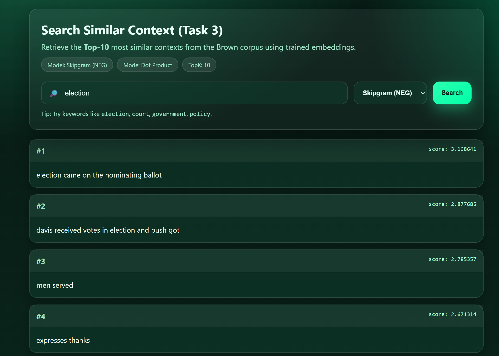

# NLP Assignment 1 – Word Embedding & Similarity Search
---

## 📌 Overview

This project implements and evaluates word embedding models including:

- Skipgram
- Skipgram with Negative Sampling
- GloVe (from scratch)
- GloVe (pretrained with gensim)

The embeddings are evaluated using:

- Word analogy tasks (semantic & syntactic)
- Word similarity dataset (WordSim353) with Spearman correlation
- A web application for context search using dot product similarity

---

## 📁 Project Structure

```text
notebooks/      -> Jupyter notebooks for Task 1 and Task 2  
app/            -> Flask web application for Task 3  
data/           -> Datasets used in experiments  
models/         -> Trained embedding models (.npz)  
requirements.txt
README.md
```
---
## 🧪 Task 1 & Task 2

The Jupyter notebooks contain:

- Training of Skipgram, Skipgram (NEG), and GloVe models
- Word analogy evaluation (semantic & syntactic)
- Word similarity evaluation using WordSim353 dataset
- Spearman correlation computation between model similarity and human judgment

Notebook files:

- `notebooks/A1_Task1_st126130.ipynb`
- `notebooks/A1_Task2_st126130.ipynb`

---

## 🌐 Task 3 – Web Application

A Flask-based web application is developed to perform similarity search.

### Features

- Users can input a query sentence
- Select embedding model
- Retrieve Top-10 most similar contexts
- Similarity is computed using dot product

### Example Result

The figure below shows an example search using the query **"election"** with Skipgram (NEG) embeddings.



### Similarity Method

- Query vector: average of word vectors
- Similarity metric: dot product
- Corpus: Brown corpus (news category)

---

## ▶️ How to Run the Web Application

```bash
pip install -r requirements.txt
python app/app.py
```
Then open in your browser: http://127.0.0.1:5000

---
## Acknowledgement

The folder `notebooks/ref_code/` contains reference implementations provided by my course instructor and adapted from the following repository:

https://github.com/chaklam-silpasuwanchai/Python-fo-Natural-Language-Processing

These codes are used strictly for learning and comparison purposes.  
All other codes, experiments, and web application development were completed by the student.

---

Name: Aphisit Jaemyaem
Student ID: st126130  
